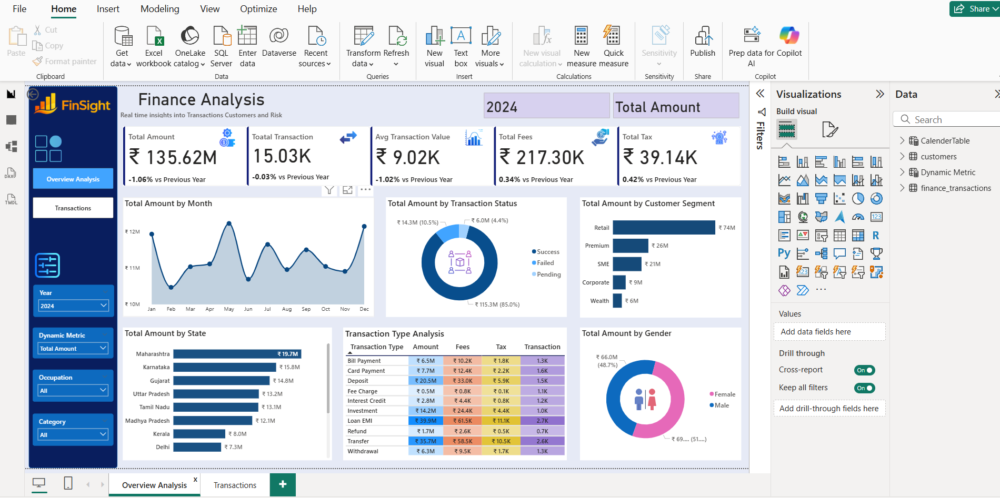
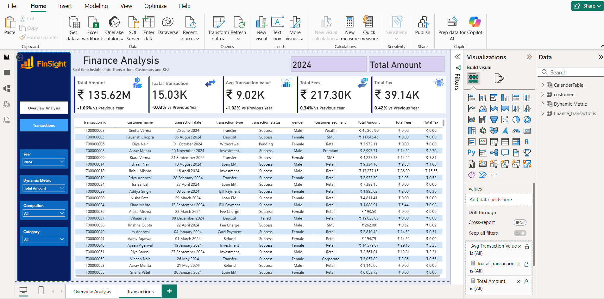

# 📊 Finance Analysis Dashboard (Power BI)

## 📌 Project Overview

This project is an interactive Finance Analysis Dashboard built using Microsoft Power BI.

It provides insights into:

- Total Amount
- Total Transactions
- Average Transaction Value
- Total Fees
- Total Tax
- Customer Segments
- Transaction Status
- State-wise Analysis
- Gender Analysis
- Monthly Trends


## 🚀 Features

- Interactive Dashboard
- Dynamic KPI Cards
- Slicers for Year, Occupation and Category
- Drill-through Page
- Dynamic Measures
- Cross-filtering Visuals


## 🛠 Tools Used

- Microsoft Power BI
- DAX
- Power Query
- Excel / CSV


## 📷 Dashboard Preview

### Overview



### Transactions




## 📂 Project Structure

```
Finance-Analysis-PowerBI/
│
├── Finance_Analysis.pbix
├── README.md
├── LICENSE
├── logos
│
├── datasets/
│   ├── customers.csv
│   └── finance_transactions.csv
│
└── screenshots/
    ├── overview.png
    └── transactions.png
```

##  Dataset

The dataset used in this project is publicly available.

**Dataset Link:**

https://drive.google.com/drive/u/0/mobile/folders/15wlZbKgQGb1qiCS4e1PPmpjsc9UGprex?usp=sharing

Due to its large size, the dataset is not included in this repository.


## ⭐ Author

**Kusuma K S**

Artificial Intelligence and Data Science Student

GitHub: https://github.com/kusumaks06

